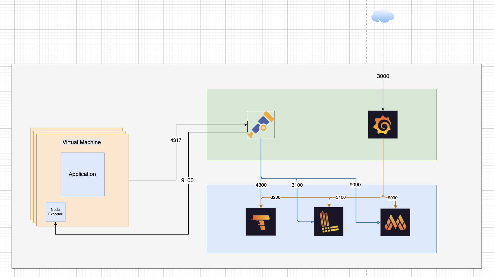

# Wine Classification 

## Mô tả
Dự án này xây dựng một API sử dụng FastAPI để phân loại rượu vang dựa trên mô hình học máy đã huấn luyện. Mô hình và scaler đã được train trong lab 1 và lưu dưới dạng file `.pkl` và `.joblib` trong `src/model/`.

## Tính năng
- Nhận dữ liệu đặc trưng của rượu vang và trả về kết quả phân loại.
- API RESTful với FastAPI.
- Đóng gói chạy bằng Docker/Docker Compose.
- Hỗ trợ logging, tracing, metrics

## Kiến trúc Monitoring
- LGTM Stack (Loki, Grafana, Tempo, Mimir)
- Open Telemetry 
- Node Exporter



## Demo


https://github.com/user-attachments/assets/3b83282a-779b-44da-a35d-5de24d8cc0f2


Chạy test request số lượng lớn concurrency
```sh
./test_request.sh
```
## Pull Docker image from docker hub
Docker hub: https://hub.docker.com/r/nhan0612/cs317/tags

```sh
docker pull nhan0612/cs317:latest
```


---

## Cài đặt môi trường

### 1. Clone repository

```sh
git clone <repository-url>
cd <tên-thư-mục-dự-án>
```

### 2. Tạo virtual environment 
```sh
python3 -m venv venv
source venv/bin/activate  # Trên Windows: venv\Scripts\activate
```

### 3. Cài đặt các thư viện phụ thuộc
**Lưu ý:** Tất cả các thư viện đều được khai báo cụ thể phiên bản trong file [`requirements.txt`](requirements.txt).  

```sh
pip install -r requirements.txt
```

---

## Chạy ứng dụng

### 0. Training với mlflows (Optional)

```sh
python train.py
```

### 1. Chạy trực tiếp bằng FastAPI/Uvicorn

```sh
uvicorn src.main:app --reload
```
API sẽ chạy tại địa chỉ: http://127.0.0.1:8000 

### 2. Chạy bằng Docker

#### Build image:
```sh
docker build -t wine-api .
```

#### Run container:
```sh
docker run -p 8000:8000 wine-api
```

### 3. Chạy bằng Docker Compose

```sh
docker-compose up -d
```

---

